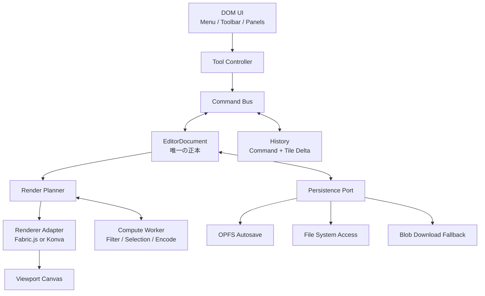

# Web画像編集アプリ 調査結果・作業計画

- 調査日: 2026-07-30（JST）
- 対象: Photoshop / GIMP のようなレイヤー型画像編集Webアプリ
- 文書種別: 初期調査・技術選定・MVP作業計画
- 実装状況: MVPを`agent/image-editor-mvp`へ実装済み。検証結果と後続課題は[実装状況](./docs/IMPLEMENTATION_STATUS.md)を参照

## 0. 今回の実行結果

この文書は当初、2〜3名・11〜16週間を想定した完全なMVP計画として作成した。今回の実装では、GitHub Pagesで実際に評価できる垂直スライスを完了条件とし、Phase 1〜3の主要フローとPhase 4の安全性・アクセシビリティ基礎まで実装した。Worker、タイルレンダラー、ピクセル選択、全ブラウザ実機監査など、計測や専用開発期間が必要な項目は未実装のまま明示している。

| 項目 | 結果 |
|---|---|
| Git運用 | `main`の初期計画コミットから`agent/image-editor-mvp`を作成し、実装完了後にPR化 |
| 製品 | React / TypeScript / Fabric.jsによるlocal-first画像編集MVP |
| 保存 | version 1プロジェクト、File System Access、download fallback、世代管理付きOPFS/localStorage自動保存 |
| 配布 | GitHub Pages用サブパスビルド、原子的PWA precache、オフライン起動、保存後の更新切替 |
| 品質 | unit、Chromium E2E、axe、strict build、依存監査、画像デコード前制限 |
| 意図的な後続 | Worker/OffscreenCanvas、タイル差分、ピクセル選択、PSD/XCF、全ブラウザ/支援技術実機監査 |

## 1. 結論

本アプリは、まず「Photoshop/GIMP完全互換」ではなく、次の条件を満たすデスクトップ向けラスター画像編集MVPとして開始する。

- 画像を既定でサーバーへ送らないローカルファースト構成
- 8bit RGBA / sRGB
- PNG・JPEG・WebPの読み込みと書き出し
- レイヤー、選択、ブラシ、消しゴム、移動・変形、基本フィルター、Undo/Redo
- 独自プロジェクト形式、OPFS自動保存、オフライン起動
- Chrome / Edge / Firefox / Safariの現行主要版を対象

暫定技術構成は以下とする。

| 領域 | 暫定方針 |
|---|---|
| UI | React + TypeScript + Vite。メニュー、ツールバー、レイヤーパネル、設定UIはDOMで実装 |
| ドキュメント | ライブラリ非依存の `EditorDocument` を唯一の正本にする |
| 編集操作 | CommandパターンとトランザクションでUndo/Redoを管理 |
| 描画 | [Fabric.js](https://fabricjs.com/docs/core-concepts/)を第一候補、[Konva](https://konvajs.org/docs/overview.html)を比較候補 |
| 画素処理 | Web Worker + [OffscreenCanvas](https://developer.mozilla.org/en-US/docs/Web/API/OffscreenCanvas)。必要な機能だけOpenCV.js等を遅延ロード |
| 保存 | OPFSに自動保存、File System Access APIは機能検出して利用、非対応環境はBlobダウンロード |
| GPU | MVPの必須条件にしない。必要ならWebGL経路を追加し、WebGPUは後期実験とする |
| バックエンド | MVPでは不要。同期・共同編集・AI処理を追加するときに再検討 |

最重要の設計判断は、CanvasやFabric/KonvaのJSONをアプリの正本にしないことである。文書モデル、履歴、保存形式を描画ライブラリから分離し、性能上必要になった場合にレンダラーを交換できる構造にする。

## 2. 調査方法と評価軸

公式サイト、公式ドキュメント、GitHub公式リポジトリを優先して確認した。GitHubのスター数、最終push、リリースは2026-07-30時点のスナップショットであり、人気ではなく次の観点で候補を評価した。

- 本アプリの機能にどこまで直接利用できるか
- ドキュメントモデル、履歴、保存形式を独自に保てるか
- 大画像、多数レイヤー、連続ポインター入力に耐えられるか
- Worker、OffscreenCanvas、GPUとの組み合わせやすさ
- 更新状況、テスト、ブラウザ互換性
- OSSライセンスと第三者依存物
- アクセシビリティとセキュリティを補完できるか

スター数は参考値に留め、技術選定はPhase 0の同一条件ベンチマークで決定する。

## 3. Web検索から得た参考情報

### 3.1 製品・UXのベンチマーク

| 参考先 | 参考にする点 | 取り扱い |
|---|---|---|
| [Photopea](https://www.photopea.com/) | ローカル処理、PSD中心の文書管理、複数ドキュメント、Photoshopに近いパネル・ショートカット・保存導線 | 製品・UXベンチマークのみ。[公式GitHub](https://github.com/photopea/photopea)にも本体ソースは公開されていないため、コード流用先にしない |
| [Photopea: Opening and Saving](https://www.photopea.com/learn/opening-saving) | 開く、ドラッグ&ドロップ、貼り付け、編集可能形式と配布形式を分ける考え方 | 独自プロジェクト形式とフラット画像書き出しを分離する根拠にする |
| [Photopea: Privacy](https://www.photopea.com/privacy.html) | 画像を端末内で処理するという明快なプライバシー説明 | 本アプリにも「画像を送信しないモード」と保存先説明を設ける |
| [GIMP 3 Documentation](https://docs.gimp.org/3.0/en_GB/gimp-help-index.html) | レイヤー、グループ、マスク、選択チャンネル、ツールオプション、履歴の機能分類 | 機能用語と受け入れ条件の参考。GPLコードや資産は直接流用しない |

### 3.2 ブラウザ基盤

| 技術 | 調査で確認したこと | 計画への反映 |
|---|---|---|
| [Canvas API](https://developer.mozilla.org/en-US/docs/Web/API/Canvas_API) | 画像合成、パス、テキスト、ピクセル操作の基本。大きさ・メモリ上限は環境依存 | 一枚の巨大Canvasと全画像コピーに依存せず、将来のタイル化を前提にする |
| [OffscreenCanvas](https://developer.mozilla.org/en-US/docs/Web/API/OffscreenCanvas) | Worker内でCanvas処理を実行でき、メインスレッド負荷を分離できる | フィルター、サムネイル、エクスポート、チェックポイント生成をWorkerへ移す |
| [Transferable objects](https://developer.mozilla.org/en-US/docs/Web/API/Web_Workers_API/Transferable_objects) | `ArrayBuffer`、`ImageBitmap`、`OffscreenCanvas`等をコピーせず移動できる | Worker間で巨大RGBA配列を複製しない。転送後の所有権を明確化する |
| [OPFS](https://developer.mozilla.org/en-US/docs/Web/API/File_System_API/Origin_private_file_system) | 高性能なオリジン専用保存領域。Worker内では同期アクセスも利用可能 | 自動保存、履歴チェックポイント、クラッシュ復旧用に使う。ユーザーの正本とはみなさない |
| [File System Access API](https://developer.mozilla.org/en-US/docs/Web/API/File_System_API) | 直接開く・保存するAPIがあるが、一部機能は全主要ブラウザ共通ではない | progressive enhancementとし、`<input type=file>`とBlobダウンロードを必須経路にする |
| [Canvas CORS制約](https://developer.mozilla.org/en-US/docs/Web/HTML/How_to/CORS_enabled_image) | CORS許可のない外部画像を描くとCanvasがtaintされ、画素読出し・保存が失敗する | MVPでは外部URL読込を無効化するか、CORS対応fetch→Blobだけに限定する |
| [Canvasの色空間](https://developer.mozilla.org/en-US/docs/Web/API/ImageData/colorSpace) | sRGB / Display-P3指定は存在するが一部機能はLimited availability | MVPはsRGB・8bitに固定。Display-P3、float16、ICC、CMYKは後段へ分離 |
| [WCAG 2.2](https://www.w3.org/WAI/standards-guidelines/wcag/) | キーボード操作、フォーカス、ドラッグ代替、状態通知等が必要 | Canvas外のDOM UIを主要操作面とし、WCAG 2.2 AAをUIの目標にする |

### 3.3 描画方式についての判断

- Fabric.jsは選択、変形ハンドル、テキスト、図形、ブラシ、重なり順、フィルター、JSON/SVG/画像出力を持ち、編集UIの立ち上げが最も速い。
- KonvaはReact連携、Canvasレイヤー分割、キャッシュ、イベント処理に強い。注釈・図形中心ならFabric.jsより適する可能性がある。
- PixiJSはWebGL/WebGPU、マスク、ブレンドモード、GPUフィルターに強いが、編集ハンドル、履歴、保存モデル等を広く自作する必要がある。
- [PixiJSの公式レンダラーガイド](https://pixijs.com/8.x/guides/components/renderers)も、本番ではWebGLを推奨し、WebGPUは実装差の影響が残るとしている。WebGPUをMVPの必須経路にはしない。
- Fabric.js、Konva、PixiJSを初期から混在させない。座標、選択、レイヤー順、状態同期が二重化するため、Phase 0で一つを選ぶ。

## 4. GitHub調査で抽出した候補

### 4.1 採用・PoC候補

| 区分 | リポジトリ | 2026-07-30時点 | 参考にする点 | 判断 |
|---|---|---|---|---|
| 第一候補 | [fabricjs/fabric.js](https://github.com/fabricjs/fabric.js) | 約31.4k stars、v7.4.0、2026-07-30 push、MIT | オブジェクト編集、テキスト、ブラシ、フィルター、clip path、シリアライズ | Phase 0の基準実装。条件を満たせばMVP採用 |
| 対抗候補 | [konvajs/konva](https://github.com/konvajs/konva) | 約14.7k stars、v10.3.0、2026-07-28 push、MIT | ノード階層、複数レイヤー、キャッシュ、React統合、イベント | 同じPoCを実装しFabric.jsと比較。一方だけを採用 |
| 高性能代替 | [pixijs/pixijs](https://github.com/pixijs/pixijs) | 約47.9k stars、v8.19.0、2026-07-19 push、MIT | WebGL/WebGPU、マスク、フィルター、ブレンド、テクスチャ管理 | Fabric/Konvaが性能基準を満たさない場合のみ次のPoCへ |
| 高度画素処理 | [opencv/opencv](https://github.com/opencv/opencv) / [OpenCV.js docs](https://docs.opencv.org/4.12.0/d5/d10/tutorial_js_root.html) | 約90.2k stars、v5.0.0、2026-07-30 push、Apache-2.0 | 閾値、輪郭、色変換、形態学処理、将来の自動選択 | 標準フィルターには導入せず、高度機能だけWorkerで遅延ロード |
| 大画像処理 | [kleisauke/wasm-vips](https://github.com/kleisauke/wasm-vips) | 約0.9k stars、v0.0.18、2026-07-30 push、ラッパーMIT | 低メモリのストリーミング処理、並列パイプライン | early developmentのためMVP後。実測と第三者ライセンス確認が採用条件 |
| PSD将来候補 | [Agamnentzar/ag-psd](https://github.com/Agamnentzar/ag-psd) | 約0.7k stars、2026-07-02 push、MIT | ブラウザとWorkerでPSD読書き、レイヤー・マスク情報 | RGB/8bit等の制約があるため、PSD互換を独立プロジェクトとしてPoC |

### 4.2 完成アプリ・機能設計の参考

| 区分 | リポジトリ | 2026-07-30時点 | 参考にする点 | 注意 |
|---|---|---|---|---|
| 完成アプリ | [viliusle/miniPaint](https://github.com/viliusle/miniPaint) | 約3.4k stars、v4.14.3、2026-04-20 push、MIT文面の独自ファイル | レイヤー、選択、ブラシ、魔法の杖、クローン、履歴、多数のフィルター、JSON保存 | 機能一覧、操作仕様、受け入れ試験の基準にする。丸ごとの基盤化はしない |
| 短期SDK案 | [scaleflex/filerobot-image-editor](https://github.com/scaleflex/filerobot-image-editor) | 約1.9k stars、v4.9.1、2026-06-16 push、MIT | React/Konva統合、crop、調整、注釈、履歴、保存UI | 本格的な複数レイヤー編集には不足。製品範囲を簡易編集へ縮小する場合の代案 |
| UX参考のみ | [nhn/tui.image-editor](https://github.com/nhn/tui.image-editor) | 約7.7k stars、v3.15.3、最終push 2023-11-20、MIT | crop、回転、図形、テキスト、マスク、フィルター、テーマAPI | Fabric 4.2依存かつ長期停滞。新規プロジェクトの中核依存にはしない |
| 概念設計のみ | [GNOME/gimp](https://github.com/GNOME/gimp) | GitHubはGNOME GitLabのread-only mirror、GPL-3.0-or-later | レイヤー、マスク、チャンネル、選択、Undo、プラグインの機能境界 | コードやUI資産を流用せず、用語・機能構成・テスト観点だけ参照 |
| 非破壊編集参考 | [darktable-org/darktable](https://github.com/darktable-org/darktable) | 活発に更新、GPL-3.0 | 非破壊処理パイプライン、履歴スタック、before/after、マスク付き調整 | デスクトップC実装。概念参照に限定 |

### 4.3 採用方針

1. `EditorDocument`、Command履歴、保存形式を先に定義する。
2. Fabric.jsで基準PoCを作る。
3. 同じシナリオをKonvaで作り、実装量・性能・保存復元性を比較する。
4. Fabric.jsが基準を満たせば採用する。
5. Fabric.js / Konvaで満たせない性能課題が計測された場合に限り、PixiJS / WebGLを評価する。
6. OpenCV.js、wasm-vips、ag-psdは機能単位の遅延ロード候補とし、MVPの初期バンドルへ含めない。

### 4.4 ライセンス方針

- MIT / Apache-2.0の直接依存も、著作権表示とライセンス文を配布物へ含める。
- `THIRD_PARTY_NOTICES.md` と依存ライセンス一覧をCIで生成・検査する。
- GIMP / darktable等のGPLコードは、別ライセンス方針を採らない限りコピーしない。
- wasm-vips自体はMITでも、libvipsはLGPL-2.1-or-laterであり、同梱バイナリと第三者codecの条件を法務・配布方式の観点で確認する。
- リポジトリ内の画像、ブラシ、フォント、アイコンは、ソースコードと同じライセンスとは限らない。再利用前に個別確認する。
- Photopea、Photoshop、GIMPの名称、ロゴ、アイコン、固有UI資産を模倣・転用しない。

## 5. MVPの製品定義

### 5.1 想定ユーザー

- ブラウザだけで画像を切り抜き、調整し、複数レイヤーで合成したいユーザー
- 機密画像を外部へアップロードしたくないユーザー
- マウス、キーボード、ペンタブレットを使うデスクトップユーザー

モバイルは表示崩れを起こさないことを目標にするが、高精度な編集操作と完全な機能同等性はMVPの対象外とする。

### 5.2 MVPに含める機能

| 分類 | MVP |
|---|---|
| ファイル | PNG / JPEG / WebP読込、ドラッグ&ドロップ、クリップボード貼り付け、同形式への書き出し |
| 文書 | 新規作成、キャンバスサイズ変更、背景透明、sRGB / 8bit RGBA |
| 表示 | pan、zoom、fit、100%、チェッカーボード、ルーラーは任意 |
| レイヤー | 追加、複製、削除、名前変更、順序、表示、ロック、透明度、基本ブレンド |
| 変形 | 移動、拡大縮小、回転、反転、crop |
| 描画 | ブラシ、消しゴム、スポイト、基本色選択 |
| 選択 | 矩形、楕円、フリーハンド、全選択、解除、反転、コピー・切取・貼付 |
| 調整 | 明るさ、コントラスト、彩度、色相、グレースケール、ぼかし、シャープ |
| 履歴 | Undo / Redo、履歴パネル、連続操作のトランザクション化 |
| 保存 | 独自プロジェクト形式、OPFS自動保存、クラッシュ復旧、PNG/JPEG/WebP書き出し |
| UI | メニュー、ツールバー、ツール設定、レイヤー、履歴、プロパティ、ショートカット一覧 |
| PWA | アプリシェルのオフライン起動、更新前の未保存確認 |

### 5.3 MVPに含めない機能

- PSD / PSB / XCFの完全な読み書き・round trip
- CMYK、LAB、ICC完全保持、Display-P3、16/32bit、HDR
- RAW、HEIF、TIFF、動画、アニメーション
- Smart Object、完全なAdjustment Layer、レイヤースタイル
- Photoshop互換ブラシエンジン
- 複数ユーザー共同編集、クラウド同期、アカウント
- 生成AI、背景除去、生成修復
- 未信頼の第三者プラグイン実行

これらはMVPの設計を壊さない拡張点だけ用意し、実装は後続フェーズへ回す。

## 6. 推奨アーキテクチャ



### 6.1 基本原則

- Canvasは `EditorDocument` の投影結果であり、永続データの正本にしない。
- Fabric/Konvaオブジェクトへアプリ固有の全状態を詰め込まない。[Fabric.js自身も、描画に不要なアプリ状態をFabricオブジェクトへ持たせないよう案内している](https://fabricjs.com/docs/using-custom-properties/)。
- UI状態、編集文書、履歴、デコード済み画像、GPUキャッシュを分ける。
- 文書座標、ビューポート座標、DOM座標、device pixel ratioを型・関数で分離する。
- Tool、Renderer、Codec、Filter、Storageはインターフェース越しに交換できるようにする。
- Worker処理はID、世代番号、`AbortSignal`相当を持ち、古い結果を現在の文書へ適用しない。

### 6.2 ドキュメントモデル

最低限、次の情報を保持する。

```text
EditorDocument
├── schemaVersion
├── metadata: width, height, dpi, colorSpace
├── rootLayerIds[]
├── layersById
│   ├── RasterLayer
│   ├── TextLayer        (MVP後半または次フェーズ)
│   ├── VectorLayer      (MVP後半または次フェーズ)
│   └── GroupLayer       (次フェーズ)
├── rasterAssetsById
├── selectionsById
└── projectSettings
```

各レイヤーはID、名前、表示、ロック、透明度、ブレンドモード、変換行列、アセット参照、マスク参照、エフェクトスタックを持てる形にする。MVPで未実装のフィールドもスキーマ上の拡張余地を確保する。

### 6.3 履歴

- 全文書・全RGBAのスナップショットを操作ごとに保存しない。
- `execute` / `undo` / `redo` と影響範囲を持つCommandを使う。
- pointer downからpointer upまでのブラシ描画を履歴1件にする。
- スライダーの連続変更も、確定時に履歴1件へ統合する。
- ラスター変更は256pxまたは512pxタイルのcopy-on-write差分を候補にする。
- 定期チェックポイントとCommandジャーナルを併用する。
- メモリ予算超過時は、古い履歴をOPFS上のチェックポイントへ集約する。
- 自動保存では未完了トランザクションを書き込まない。

4096 × 4096の8bit RGBA一枚は約64MiBである。10レイヤーを未圧縮で複製すると約640MiBとなり、履歴・キャッシュ・GPUテクスチャを含めると容易にタブが不安定になる。このため、タイル差分と明示的なキャッシュ上限は後付けではなく基礎設計に含める。

### 6.4 レンダリングと画素処理

- ビューポートの選択・変形・テキスト等はFabric.jsまたはKonvaで処理する。
- フィルター、選択マスク演算、サムネイル、エクスポートはWorkerへ送る。
- Workerとの間は `ArrayBuffer` / `ImageBitmap` をtransferし、不要なコピーを避ける。
- プレビューは低解像度、確定後は本解像度で処理できる構成にする。
- dirty rectangle / dirty tileだけを再計算する。
- デコード済み画像、タイル、GPUテクスチャはLRU上限を持つ。
- context loss時はキャッシュを破棄し、`EditorDocument`から再構築する。
- WASM化は前提にせず、JavaScript Worker、WASM、GPUを転送時間込みで比較する。
- `getImageData()`を多用するCPU面と、GPU表示面を分離する。

### 6.5 保存形式

独自プロジェクト形式は、将来のマイグレーションを前提としたZIP系コンテナを候補とする。

```text
project.imageedit
├── manifest.json
├── preview.webp
├── assets/
│   └── <content-hash>.<format>
├── tiles/
│   └── <layer-id>/<x>-<y>.bin
└── journal/
    └── commands.bin
```

- `manifest.json` に必ず `schemaVersion` を含める。
- 保存は一時ファイルへ書いた後に完了マーカーを更新し、中断した保存を正本にしない。
- 読み込み時にスキーママイグレーションを行う。
- OPFSは自動保存・復旧用とし、サイトデータ消去で失われることをUIで説明する。
- File System Access API対応環境では明示保存を強化し、非対応環境ではダウンロードを使う。
- エクスポートは文書のフラット合成結果をPNG / JPEG / WebPへ変換する。

## 7. 作業計画

### 全体見積もり

2〜3名の開発者で、Phase 0〜4のMVPを11〜16週間の仮置きとする。1名体制では並列化できないPoC、UI、画素処理、ブラウザ検証があるため、単純な人数割り以上に長期化する。

| フェーズ | 期間目安 | 主成果物 |
|---|---:|---|
| Phase 0 | 1〜2週間 | スコープ、比較PoC、ADR、性能予算 |
| Phase 1 | 2〜3週間 | アプリ基盤と開く→表示→書き出す垂直スライス |
| Phase 2 | 4〜5週間 | レイヤー、選択、描画、変形、フィルター、履歴 |
| Phase 3 | 2〜3週間 | 独自形式、OPFS自動保存、PWA、復旧 |
| Phase 4 | 2〜3週間 | 性能、セキュリティ、アクセシビリティ、クロスブラウザ品質 |

### Phase 0: 調査・判断スパイク

#### 作業

- [x] P0-01 対象ユーザーと上位3ワークフローを確定する
- [x] P0-02 最大画像寸法、レイヤー数、履歴数、対象端末を仮決定する
- [ ] P0-03 Fabric.jsとKonvaで同一PoCを作る
- [ ] P0-04 必要ならPixiJSの最小比較を行う
- [ ] P0-05 Worker / OffscreenCanvasでフィルターと書き出しを検証する
- [ ] P0-06 OPFS、File System Access、ダウンロードfallbackを4ブラウザで確認する
- [x] P0-07 依存ライセンス、バンドルサイズ、CSP、更新状況を棚卸しする
- [x] P0-08 ADR-001〜005を作成する

#### PoCシナリオ

- 4096 × 4096の背景画像
- ラスター10〜20レイヤー
- テキスト・図形100個
- 連続ブラシ入力
- ぼかし、色調整、マスク相当処理
- 50回のUndo/Redo
- 保存、再読込、PNG / JPEG / WebP書き出し
- WebGL context loss、容量不足、破損画像、CORS失敗

#### 比較指標

- 実装コード量と独自補助コード量
- pan / zoom / 変形中のframe time
- pointer入力からブラシプレビューまでの遅延
- 50ms超のmain thread long task
- フィルタープレビューと本解像度確定時間
- ピークメモリと解放後メモリ
- 初回ロード量、遅延ロード量
- 文書保存・復元後のピクセル差
- キーボード操作とDOMアクセシビリティの実装工数

#### 受け入れ条件

- MVPの対象・対象外が承認されている。
- 基準端末、画像fixture、性能予算が定義されている。
- Fabric.js / Konvaの採否を計測結果で説明できる。
- 描画、履歴、保存、プロジェクト形式、プライバシーのADRが承認されている。

### Phase 1: 基盤と垂直スライス

#### 作業

- [x] P1-01 React / TypeScript / ViteのプロジェクトとCIを作る
- [x] P1-02 メニュー、ツールバー、キャンバス、レイヤーパネルのアプリシェルを作る
- [ ] P1-03 `EditorDocument`、スキーマ検証、座標型を実装する（v1スキーマとrenderer境界は完了。renderer非依存の完全モデルは後続）
- [ ] P1-04 Command BusとUndo/Redoの最小実装を作る（上限100件のsnapshot履歴でMVPを実装）
- [x] P1-05 Renderer Adapterを実装する
- [x] P1-06 PNG / JPEG / WebPを開き、1レイヤーとして表示する
- [x] P1-07 pan / zoom / fit / 100%表示を実装する
- [ ] P1-08 PNG書き出しをWorker経路で実装する（PNG/JPEG/WebP書き出しは完了、Worker化は後続）
- [x] P1-09 unit、component、Playwright E2Eの基盤を作る
- [ ] P1-10 エラー境界、処理中表示、キャンセルを実装する（エラー境界と処理中表示は完了、処理キャンセルは後続）

#### 受け入れ条件

- PNG / JPEG / WebPを開き、pan / zoom後にPNGへ書き出せる。
- zoom、ウィンドウ変更、device pixel ratio変更後も文書座標がずれない。
- Undo/Redo後に `EditorDocument` のシリアライズ結果が戻る。
- Renderer内部状態を文書の正本として読む実装がない。
- 主要な処理失敗が画面全体のクラッシュにならない。

### Phase 2: 編集MVP

#### 作業

- [x] P2-01 レイヤー追加、複製、削除、名前、順序、表示、ロックを実装する
- [x] P2-02 透明度と基本ブレンドモードを実装する
- [x] P2-03 移動、拡大縮小、回転、反転、cropを実装する
- [ ] P2-04 ブラシ、消しゴム、スポイトを実装する（ブラシと合成消しゴムは完了、スポイトは後続）
- [ ] P2-05 矩形、楕円、フリーハンド選択を実装する
- [ ] P2-06 選択の追加、削除、反転、コピー、切取、貼付を実装する（オブジェクト単位の複数選択とcopy/cut/pasteは完了）
- [x] P2-07 明るさ、コントラスト、彩度、色相、グレースケールを実装する
- [ ] P2-08 ぼかし、シャープを実装する（ぼかしは完了、シャープは後続）
- [ ] P2-09 低解像度プレビューと確定処理を分ける
- [x] P2-10 履歴パネルとショートカットを実装する
- [x] P2-11 スライダー、ブラシストローク、変形を履歴トランザクション化する
- [x] P2-12 数値入力による位置、サイズ、回転、透明度変更を実装する

#### 受け入れ条件

- 20レイヤーの基本プロジェクトを編集できる。
- 100件の混合操作をUndoすると、文書ハッシュと対象ピクセルハッシュが初期状態へ戻る。
- スライダー1回のドラッグ、ブラシ1ストローク、変形1回がそれぞれ履歴1件になる。
- フィルター処理中もメニューとキャンセル操作が応答する。
- マウスだけでなく、キーボードから主要レイヤー操作と数値変形を行える。

### Phase 3: 保存・オフライン・復旧

#### 作業

- [x] P3-01 バージョン付き独自プロジェクト形式を実装する
- [ ] P3-02 保存・再読込の画像golden testを作る（構造round-trip E2Eは完了、pixel goldenは後続）
- [ ] P3-03 OPFS自動保存とCommandジャーナルを実装する（世代管理付き自動保存は完了、Command journalは後続）
- [ ] P3-04 クラッシュ後の復旧候補一覧と復元を実装する（最新候補1件の復元は完了、複数候補一覧は後続）
- [x] P3-05 File System Access APIの直接保存をprogressive enhancementとして実装する
- [x] P3-06 Blobダウンロードfallbackを実装する
- [x] P3-07 PWAアプリシェルとオフライン起動を実装する
- [x] P3-08 Service Worker更新時の未保存文書保護を実装する
- [ ] P3-09 ストレージ使用量、quota不足、データ消去の説明UIを作る（失敗状態とデータ消去説明は完了、使用量表示は後続）
- [ ] P3-10 スキーママイグレーション試験を作る（未知version拒否は完了、次versionの実マイグレーションは後続）

#### 受け入れ条件

- 20レイヤーのプロジェクトが保存・再読込後に定めた誤差内で同じ外観になる。
- 保存中にタブを終了しても、直前の正常チェックポイントを壊さない。
- 一度オンラインで起動した後、ネットワークなしで起動、編集、保存できる。
- quota不足、権限拒否、ダウンロード失敗を区別して案内できる。
- 新バージョンへの移行に失敗しても旧データを保持する。

### Phase 4: 堅牢化・性能・品質

#### 作業

- [ ] P4-01 タイル差分、dirty region、キャッシュLRUを実装または完成させる
- [ ] P4-02 Worker処理のキャンセル、タイムアウト、世代管理を完成させる
- [ ] P4-03 Chrome / Edge / Firefox / SafariのE2Eを整備する
- [ ] P4-04 破損画像、巨大寸法、メタデータ過多、圧縮爆弾相当をfuzzする
- [x] P4-05 CORS、SVG、ファイル名、CSP、依存関係をhardeningする
- [ ] P4-06 WCAG 2.2 AAに基づく自動検査と手動検査を行う（axe critical/serious 0と主要keyboard E2Eは完了、実機監査は後続）
- [ ] P4-07 VoiceOver / SafariとNVDA / FirefoxまたはChromeを手動確認する
- [ ] P4-08 固定fixtureの性能回帰テストをCIまたは定期ジョブへ追加する
- [ ] P4-09 メモリ解放、Object URL解放、ImageBitmap解放を監査する
- [x] P4-10 プライバシー説明、既知制限、対応形式を文書化する

#### 暫定性能目標

Phase 0で基準端末を決め、以下を現実的な値へ補正する。

- 4096 × 4096、20レイヤーでpan / zoomのp95 frame time 20ms以下
- pointer入力からブラシプレビューまでp95 50ms以下
- 通常操作で50ms超のmain thread taskを継続発生させない
- フィルタースライダーは低解像度プレビューを連続表示できる
- 自動保存は最終操作から5秒以内に正常チェックポイントを作る
- 強制終了時に失う確定済み編集を最大5秒相当に抑える
- キャッシュ上限超過時にLRU解放し、タブクラッシュを避ける

#### 受け入れ条件

- 固定fixtureで性能予算を満たし、前リリースからの回帰を検知できる。
- 不正入力で無制限なメモリ確保、無限処理、アプリ全体の永続破損を起こさない。
- 主要ワークフローをキーボードだけで完了できる。
- GPU無効化またはcontext loss後に、機能制限を説明して復旧できる。
- 自動アクセシビリティ検査のcritical / serious違反が0件である。

## 8. MVP後のロードマップ

### Phase 5: 高度な非破壊編集

- グループ、クリッピング、レイヤーマスク
- Adjustment Layerと並べ替え可能なエフェクトスタック
- feather、grow / shrink、magic wand、色域選択
- テキスト、シェイプ、ガイド、スナップ、整列
- 高度なブレンドモード
- Smart Object相当の参照アセット
- OpenRaster入出力の検討

### Phase 6: プロ向け機能

- ICC、Display-P3、CMYK、16/32bit
- PSD / XCFの限定インポートと互換性レポート
- RAW、HEIF / AVIF、TIFF
- 高度なブラシエンジン
- WebGL / WebGPU / WASM SIMD最適化
- 権限付きプラグインSDK

### Phase 7: オンライン機能

- 任意のクラウド同期
- 共有リンク、コメント、共同編集
- サーバー側バッチ処理
- AI選択、背景除去、生成修復

PSD / XCF対応は「ファイルが開く」だけで完了としない。未対応レイヤー、ブレンド、マスク、テキストを含むround-trip fidelity、未知情報の保持、互換性レポートを独立した受け入れ条件にする。

## 9. テスト戦略

| 種類 | 対象 |
|---|---|
| Unit | レイヤーツリー不変条件、Command apply/revert、座標変換、スキーママイグレーション |
| Property-based | ランダム操作列のUndo/Redo、座標変換の往復、レイヤー順序 |
| Image golden | アルファ合成、ブレンド、フィルター、マスク、保存復元、CPU/GPU差 |
| Component | メニュー、ツールバー、レイヤーパネル、ダイアログ、ショートカット |
| E2E | 開く、編集、Undo/Redo、保存、再読込、オフライン、権限拒否、clipboard |
| Fuzz | 破損画像、巨大寸法、過剰レイヤー、破損プロジェクト、ZIP bomb相当 |
| Performance | frame time、入力遅延、long task、ピークメモリ、フィルター、保存時間 |
| Accessibility | axe等の自動検査、キーボード、VoiceOver、NVDA、200% zoom、reduced motion |

画像golden testはOSやGPUで完全一致しない場合があるため、機能ごとに許容誤差、比較色空間、alpha premultiplicationの扱いを明文化する。

## 10. セキュリティ・プライバシー

- 画像とプロジェクトファイルを未信頼入力として扱う。
- 拡張子、MIME、magic bytes、デコード結果を組み合わせて検証する。
- ファイルサイズだけでなく、画像寸法、総ピクセル数、レイヤー数、展開後サイズを制限する。
- デコード・フィルター処理をWorkerで行い、キャンセル、時間、メモリ上限を設ける。
- MVPではSVGを拒否するか、スクリプト、`foreignObject`、外部参照を除いた隔離経路でラスター化する。
- 外部URL画像はCORS対応fetch→Blob経路以外を許可しない。
- Object URL、ImageBitmap、Canvas、GPUテクスチャを明示的に解放する。
- CSP、Trusted Typesの適用可能性、依存関係監査を行う。
- 分析SDKを導入する場合も、画像名、画像内容、レイヤー名、寸法等を送信しない。
- 画像が端末外へ送られる機能は既定OFFとし、送信前に対象と目的を表示する。

参考: [OWASP File Upload Cheat Sheet](https://cheatsheetseries.owasp.org/cheatsheets/File_Upload_Cheat_Sheet.html)

## 11. アクセシビリティ

- Canvasだけで編集UIを構成しない。
- メニュー、ツールバー、レイヤー、履歴、プロパティ、ダイアログはセマンティックなDOMにする。
- ツールバーは[WAI-ARIA Toolbar Pattern](https://www.w3.org/WAI/ARIA/apg/patterns/toolbar/)を参考にする。
- ドラッグ操作には、数値入力、矢印キーナッジ、上下移動ボタン等の代替を用意する。
- 選択対象、ズーム率、Undo/Redo、保存、処理進捗、エラーを読み上げ可能にする。
- フォーカス表示、十分なコントラスト、色だけに依存しない状態表示を実装する。
- ショートカット一覧、競合回避、変更または無効化の方針を用意する。
- 視覚的なピクセル編集そのものを完全同等に読み上げることは困難なため、主要ワークフロー単位で適合範囲と既知制限を明記する。

## 12. リスクと対策

| リスク | 影響 | 対策 |
|---|---|---|
| スコープがPhotoshop完全互換へ膨張 | MVP未完成 | MVP対象外を明文化し、機能追加を判断ゲート化 |
| 4K/8K・多数レイヤーでメモリ枯渇 | タブクラッシュ、データ消失 | タイル差分、LRU、低解像度プレビュー、OPFSチェックポイント |
| 描画ライブラリへ状態が密結合 | 交換不能、保存破損 | 独立した `EditorDocument` とRenderer Adapter |
| Worker/WASM転送がボトルネック | UI遅延 | transfer込みで計測し、全面WASM化を避ける |
| WebGPU・File System Accessの差 | ブラウザごとの機能欠落 | feature detection、WebGL/Canvas、input/download fallback |
| Canvas CORS taint | 保存不能 | 外部URL制限、CORS fetch→Blob、明確なエラー |
| 色・alphaの差 | 保存後の見た目不一致 | MVPをsRGB/8bitに限定し、golden testと誤差定義 |
| 自動保存中断 | プロジェクト破損 | 一時領域、チェックポイント、完了マーカー、旧版保持 |
| 古いOSS依存 | 脆弱性、ブラウザ非互換 | TUI等は参考のみ。active dependencyを選び、定期監査 |
| ライセンス混在 | 配布停止・再実装 | NOTICE生成、資産の個別確認、GPLコード非流用 |
| Canvas中心UIのアクセシビリティ不足 | 操作不能 | DOM操作面、キーボード代替、手動AT検証 |

## 13. 技術判断ゲート

| ゲート | 決めること | 完了条件 |
|---|---|---|
| G0 製品範囲 | desktop-first、local-first、最大画像、対応形式 | ペルソナと上位ワークフローが承認済み |
| G1 描画 | Fabric.js / Konva / PixiJS等 | 同一PoCの性能、実装量、復元性で決定 |
| G2 履歴 | Command、差分、チェックポイント | 100操作Undoとメモリ予算を満たす |
| G3 ラスター格納 | 全面buffer / 256px / 512px tile | ブラシ遅延、フィルター、メモリで決定 |
| G4 計算 | main JS / Worker JS / WASM / GPU | 転送込み実時間と出力一致で決定 |
| G5 保存 | OPFS / IndexedDB / File System Access | 4ブラウザ、quota、中断復旧を検証 |
| G6 形式 | 独自形式 / OpenRaster / PSD | 非破壊情報、互換性、ライセンスで決定 |
| G7 バックエンド | なし / 任意同期 / collaboration | プライバシー、運用費、競合解決を再評価 |

## 14. 作成すべきADR

- ADR-001: MVPの製品範囲と対象外
- ADR-002: Fabric.js / Konva / PixiJSの比較とRenderer選定
- ADR-003: `EditorDocument`、Command、履歴、タイル差分
- ADR-004: 独自プロジェクト形式とスキーマ移行
- ADR-005: OPFS、自動保存、明示保存、復旧
- ADR-006: sRGB / 8bit制約と将来の色管理
- ADR-007: ローカル処理、外部URL、分析データのプライバシー
- ADR-008: 依存ライセンスと第三者資産の管理

## 15. 直近の次アクション

1. `agent/image-editor-mvp`のドラフトPRで実装範囲と既知制限をレビューする。
2. CI成功後に`main`へマージし、GitHub Pages workflowを実行する。
3. 公開URLで初回起動、画像編集、プロジェクト保存、オフライン再読込を確認する。
4. 利用評価と4K/20レイヤー計測を基に、未完了項目の優先順位を決める。
5. Worker/OffscreenCanvas、ピクセル選択、タイル履歴は独立PRで段階導入する。

## 16. 主な参照リンク

### Web / 標準

- [MDN Canvas API](https://developer.mozilla.org/en-US/docs/Web/API/Canvas_API)
- [MDN OffscreenCanvas](https://developer.mozilla.org/en-US/docs/Web/API/OffscreenCanvas)
- [MDN Transferable objects](https://developer.mozilla.org/en-US/docs/Web/API/Web_Workers_API/Transferable_objects)
- [MDN File System API](https://developer.mozilla.org/en-US/docs/Web/API/File_System_API)
- [MDN Origin private file system](https://developer.mozilla.org/en-US/docs/Web/API/File_System_API/Origin_private_file_system)
- [MDN CORS-enabled images and tainted canvas](https://developer.mozilla.org/en-US/docs/Web/HTML/How_to/CORS_enabled_image)
- [MDN ImageData colorSpace](https://developer.mozilla.org/en-US/docs/Web/API/ImageData/colorSpace)
- [W3C WCAG 2 Overview](https://www.w3.org/WAI/standards-guidelines/wcag/)
- [OWASP File Upload Cheat Sheet](https://cheatsheetseries.owasp.org/cheatsheets/File_Upload_Cheat_Sheet.html)

### GitHub / ライブラリ

- [Fabric.js](https://github.com/fabricjs/fabric.js)
- [Konva](https://github.com/konvajs/konva)
- [PixiJS](https://github.com/pixijs/pixijs)
- [miniPaint](https://github.com/viliusle/miniPaint)
- [Filerobot Image Editor](https://github.com/scaleflex/filerobot-image-editor)
- [TOAST UI Image Editor](https://github.com/nhn/tui.image-editor)
- [OpenCV](https://github.com/opencv/opencv)
- [wasm-vips](https://github.com/kleisauke/wasm-vips)
- [ag-psd](https://github.com/Agamnentzar/ag-psd)
- [GIMP mirror](https://github.com/GNOME/gimp)
- [darktable](https://github.com/darktable-org/darktable)
- [Photopea public repository](https://github.com/photopea/photopea)

---

この計画は初期調査時点の仮説を保持しつつ、今回の実装結果をtask listへ反映したものである。未完了項目は「完成したように見せる」ために削除せず、実画像・実ブラウザ・実端末の測定結果に基づく後続バックログとして残す。
